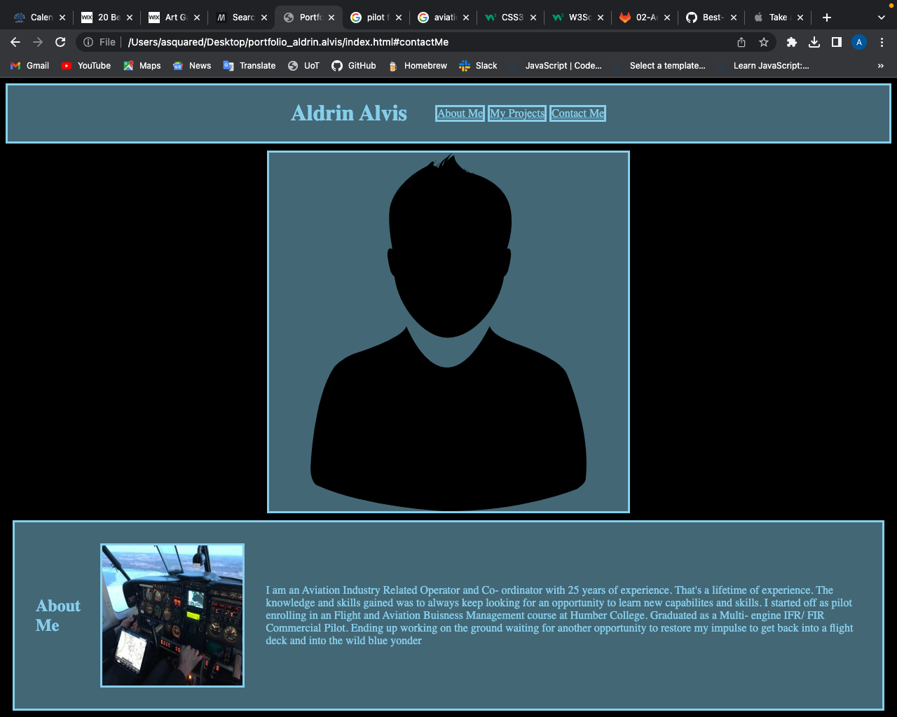

# portfolio_aldrin.alvis

<!--Portfolio-->

<!-- Description

This is a portfolio designed for potential employers to view
some of my work examples
So that futur employers can review my work and asses whether
I would be a good candidate for an open position.-->

<!-- Contents

Name
About Me
My Projects
Contact Info-->

<!-- Installation

Used the skills learned through UoT Coding Bootcamp using HTML and CSS. 
Added HTML elements to structure the portfoli
Input CSS attributes to enhance the look of the portfolio'

-->

<!-- Usage
 Scroll or use Navigate links to view information on my profile
 -->

<!-- Acknowledgements

 - fellow UoT students 
 - UoT TA's
 - W3Schools website
 - GitHub website
 - Google available images

-->
<!-- Mock up -->
 
